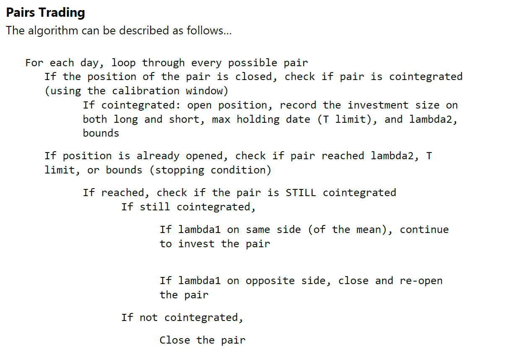

# Algorithmic Trading - Pairs Trading
Implementing basic pairs trading strategy based on cointegrated asset prices.  
We start by investigating all possible pairs of assets in our market (of interest) within the running window. After finding the coefficient between a particular pair of prices, we check its stationarity to determine the pair's cointegration. If we find a cointegrated pair, we can check to see if the price is deviating from the norm. We can open a position by buying or selling an asset and selling or buying the other when we see a strong deviation from the pair's usual relationship since we expect it to return to normal. If a position is already opened, we check for closing signals (max holding time, target price reached etc.) instead. The experiments in the notebook may not show profit, as some of the parameters were unrealistically set. A simple pseudo code of the pairs trading algorithm used can be seen below.  

